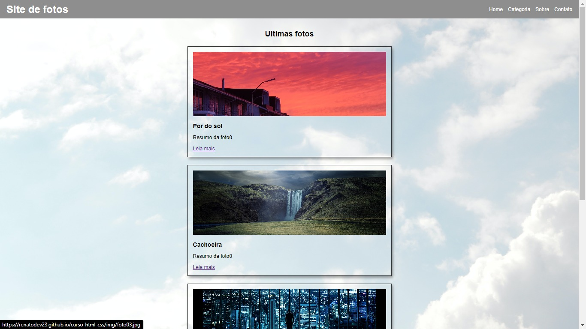

# PROJETO FEITO EM HTML E CSS<h1 align="center"> Site de fotos </h1>

## 🔖 Layout
 

  

 

## 🚀 Tecnologias

Esse projeto foi desenvolvido com as seguintes tecnologias:

## 💻 Projeto

O site foi desenvolvido em HTML e CSS como treinamento pra os estudos do Angular

- [Acesse o projeto finalizado, online](https://renatodev23.github.io/curso-html-css/index.html)

